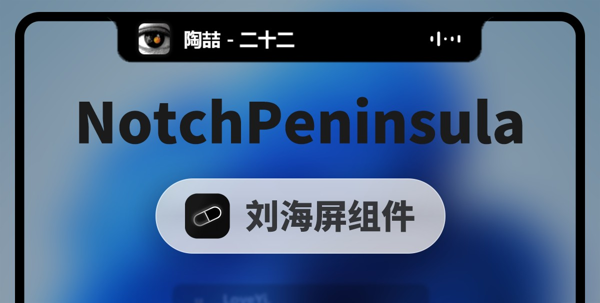

<div align="center">


<h1>NotchPeninsula</h1>
<p>专为 Windows 而生的刘海屏/灵动岛组件，极致内存占用与性能</p>


<p>
  <a href="https://github.com/GEORGEWWWU/NotchPeninsula/wiki">进阶玩法</a> &nbsp; | &nbsp;
  <a href="https://github.com/GEORGEWWWU/NotchPeninsula/releases/latest">下载地址</a> &nbsp; | &nbsp;
  <a href="https://qm.qq.com/cgi-bin/qm/qr?k=i70z7rbl-VWpejQugvlXeARDUjwP7sIW&jump_from=webapi&authKey=b6Pj6zLuuCINDhafPJRttePdy3D45vvtWzcZ109LWoWYXkcKo8bNWI7fMhr+yV87" target="_blank">交流群 1080730621</a>
</p>




</div>

## 项目概览

NotchPeninsula 是一个面向 Win 10/11 的“刘海屏”风格桌面小组件，采用 Win32 + WinRT (SMTC) + SkiaSharp + NAudio 的组合实现，核心目标是把系统媒体状态、歌词、音频可视化、通知消息整合到屏幕顶部的极窄悬浮区域中。

它会在桌面顶部（目标显示器）生成一个轻量透明窗口，实时展示：

- 当前系统媒体播放状态（标题、艺术家、播放/暂停）
- 多平台音乐应用的媒体来源识别与控制
- 逐句歌词与卡拉OK进度高亮
- 实时音频频谱柱状图
- Windows Toast 通知气泡，并可点击唤醒对应应用
- 待机信息：时间日期 / 空白 / 硬件占用（CPU、内存）
- 剪贴板链接识别，一键打开

这种设计适合单屏、窄边框布局，以及希望保留桌面空间同时拥有交互反馈的使用场景。程序常驻托盘，单实例运行，渲染循环 16ms（约 60FPS）。

## 功能特性

### 1. 灵动岛式媒体控制

- 基于 Windows SMTC 自动识别当前媒体会话
- 支持常见平台：通用媒体、网易云音乐、QQ音乐、酷狗、Spotify、Apple Music、Echo Music、LX Music
- 提供播放/暂停、上一曲、下一曲交互
- 允许在设置中锁定目标媒体来源
- 两种媒体交互方式：**直接交互**（点击按钮直接操作）与**展开交互**（悬停展开大卡片）
- 通知点击可唤醒来源应用（AUMID 唤醒：WinRT → COM → 按进程名/窗口标题置前兜底）

### 2. 歌词与卡拉OK

- 三级歌词引擎：QQ音乐 → 网易云音乐 → LRCLIB 逐级回退
- 卡拉OK 逐句进度高亮动画
- 歌词延迟补偿（±0.1s 步进、可重置），方便手动校准
- 支持接入 Just Solo LyricServer（`ws://127.0.0.1:47290`）获取歌词、进度与播放状态

### 3. 实时音频可视化

- 通过 WASAPI Loopback 捕获系统输出音频
- 使用 Goertzel / 能量分析算法计算 5 组频段强度，并带 AGC 自动增益
- 通过平滑动画渲染为可视化柱状图
- 常驻看门狗 + Core Audio 事件自恢复，设备切换后自动重建采集
- 若 Just Solo 提供 12 频段频谱，则优先使用并压缩为 5 柱显示
- 未播放媒体时仍保留简洁的音量动态效果

### 4. 待机显示与组合模式

- 待机显示内容三选一：**时间日期** / **空白** / **硬件占用**（CPU、内存标签 + 进度条）
- **组合模式**：时间日期、资源占用、媒体控制器（含频谱）同排显示，宽度按内容像素级自适应

### 5. 外观与主题

- 两种刘海形态：**经典刘海** / **悬浮胶囊**
- 主题模式：**黑色** / **白色** / **跟随系统**（监听系统主题变更实时刷新）
- 背景透明度 5 档（0% / 25% / 50% / 75% / 100%）
- 尺寸调节：待机宽度/高度、媒体激活宽度/高度、通知气泡宽度/高度、刘海底部圆角
- 全局 DPI 缩放，适配多屏不同缩放比例

### 6. Windows 通知与消息推送

- 监听系统 Toast 通知，在界面中展示标题与正文并自动淡出
- 通知点击可唤醒对应应用
- 内置本地 HTTP 服务，可接收手机端转发的消息并显示为通知（详见下文）
- 可在设置中禁用通知展示

### 7. 剪贴板链接识别

- 监听剪贴板，检测到链接后自动在刘海区域展示
- 支持一键用默认浏览器打开

### 8. 交互体验

- **自动隐藏**：无媒体、无通知、无链接时自动滑出屏幕，鼠标悬停时恢复
- **穿透模式**：悬停时完全透明并允许鼠标穿透，与底层窗口交互（带唤醒按钮）
- **窗口置顶**：可关闭，让刘海不遮挡其他窗口
- **多显示器支持**：可选择目标显示器，窗口固定在其顶部居中

### 9. 系统级配置与更新

- 开机自启（写 `HKCU\...\Run\NotchPeninsula`），托盘与设置窗口状态双向同步
- 启动时后台静默检查更新（GitHub Releases `NPS-v` 标签），发现新版本弹出更新提示窗口，可跳转下载页
- 单实例运行、禁用 CPU 节流（`SetProcessInformation`）、`timeBeginPeriod(1)` 等性能取向优化
- 配置保存在 Windows 注册表 `HKCU\SOFTWARE\NotchPeninsula`，重启后保持状态
- 日志输出到 `%LocalAppData%\NotchPeninsula\app.log`

## 使用方式

### 启动

在 Windows 上直接运行编译后的程序即可。程序启动后会驻留到托盘区，界面默认显示在目标显示器顶部居中。

### 托盘菜单

右键托盘图标可看见菜单：

- 打开设置
- 开机自启
- 退出

### 设置窗口

设置窗口共 6 个页签：

- **个性化中心**：主题、背景透明度、尺寸调节（待机/媒体/通知/DPI/圆角）
- **通用设置**：开机自启、系统消息通知、窗口置顶
- **显示设置**：刘海形态、目标显示器、待机显示内容、组合模式
- **媒体设置**：媒体控制、目标媒体平台、歌词开关、卡拉OK 开关、歌词延迟补偿
- **交互设置**：自动隐藏、媒体交互方式、穿透模式、剪贴板链接识别
- **关于软件**：版本号、检测更新、项目仓库、开发者

### 手机消息推送到灵动岛

程序在 `127.0.0.1:47300` 监听本地 HTTP 请求，手机端可通过 `POST` 推送消息：

```text
POST http://127.0.0.1:47300/api/activities/
Content-Type: application/json

{
  "kind": "应用名（作为通知来源显示，可省略）",
  "title": "标题",
  "subtitle": "正文内容"
}
```

推送成功返回 `{"ok":true}`。

### 权限要求

由于项目使用了 Windows 通知监听能力，首次运行时可能需要允许此应用访问通知：

- 设置 → 隐私和安全性 → 通知
- 打开对应权限开关

如果关闭了通知权限，Toast 监听将无法正常显示消息。

### 调试

以 `-debug` 参数启动可开启 DEBUG 级别日志，日志文件位于：

```text
%LocalAppData%\NotchPeninsula\app.log
```

## 项目结构

```text
NotchPeninsula/
├── Program.cs                 # 程序入口：单实例、DPI 感知、CPU 节流、配置加载、更新检查
├── NotchWindow.cs             # 主窗口：分层窗口、渲染定时器、动画、托盘、剪贴板与通知轮询
├── Renderer.cs                # SkiaSharp 绘制层：待机/媒体/通知/链接/组合模式/主题
├── ConsoleWindow.cs           # 全自绘设置窗口
├── AudioAnalyzer.cs           # WASAPI Loopback 采集 + Goertzel 频谱分析
├── Audio.cs                   # NAudio 系统音量读写适配层
├── SystemSettingManager.cs    # 系统音量控制封装
├── toast.cs                   # Toast 通知监听 + 本地 HTTP 消息接口
├── appactivator.cs            # 按 AUMID 唤醒 / 置前应用
├── UpdateManager.cs           # 静默检查更新与更新提示窗口
├── Win32.cs                   # Win32 API 封装
├── Logger.cs                  # 日志
├── Plugin/                    # 插件平台（宿主侧）
│   ├── PluginApi.cs           # INotchPlugin / IPluginHost / Widget / Page 等契约
│   ├── PluginHost.cs          # 插件主机：刷新调度、提醒、持久化、设置页收集
│   ├── PluginLoader.cs        # 从 plugins 目录发现并加载插件 DLL（独立 ALC）
│   ├── PluginWindow.cs        # 插件自绘窗口
│   └── WidgetLayout.cs        # 组件行布局与宽度测量
├── SamplePlugins/             # 示例/内置插件源码（独立工程，随主工程编译并部署）
│   ├── HelloPlugin/           # 最小示例插件
│   ├── SystemPlugins/         # 系统组件：媒体控制、歌词、频谱、封面、Just Solo 客户端
│   └── ThuCourse/             # 清华课程表插件（依赖仓库外的 thu-info-cs）
├── plugins/                   # 插件源目录：构建时自动刷新并整体部署到输出目录
├── docs/                      # 插件平台设计与路线文档
├── build.ps1                  # 打包脚本（单文件发布）
├── data/image/                # 平台 logo / 图标资源
├── NPS_NotchPeninsula-logo.ico # 应用图标
├── NotchPeninsula.csproj      # .NET 项目配置
├── NotchPeninsula.slnx        # 解决方案
├── LICENSE                    # Apache 2.0
└── README.md                  # 项目说明
```

## 构建与运行

### 环境要求

- Windows 10 / 11
- .NET 10 SDK（运行发布产物需 .NET 10 Desktop Runtime）
- Visual Studio 2022 或 .NET CLI

### 本地构建

```bash
dotnet restore
dotnet build -c Release
```

本地调试直接运行：

```bash
dotnet run
```

> `dotnet build` / `dotnet run` 会同时编译 `SamplePlugins` 下的插件工程，并把产物部署到输出目录 `plugins/`，无需手动拷贝 DLL（详见「插件系统」）。

### 打包发布

推荐使用打包脚本，会自动清理产物并发布为单文件 exe：

```powershell
.\build.ps1
```

> 执行前请先从托盘菜单退出正在运行的实例，否则产物会被占用。

打包脚本生成的发布文件通常位于：

```text
publish\NotchPeninsula.exe
```

> 发布产物为框架依赖单文件，目标机需已安装 .NET 10 Desktop Runtime。

手动发布
```powershell
dotnet publish -c Release -r win-x64 --self-contained false
```

手动发布生成的发布文件通常位于：

```text
bin\Release\net10.0-windows10.0.19041.0\win-x64\publish\
```

### 运行说明

运行发布产物中的可执行文件即可。该程序默认在后台托盘运行，右键托盘图标即可打开设置窗口。

## 插件系统

NotchPeninsula 的功能组件（媒体控制、歌词、频谱、硬件占用等）均以插件形式挂载。插件是独立的 .NET 类库工程，由宿主在运行时反射加载，彼此通过独立 `AssemblyLoadContext` 隔离。

### 目录约定

| 目录 | 角色 |
| --- | --- |
| `SamplePlugins/<名称>/` | 插件源码工程，包含实现代码与 `plugin.json` 清单 |
| `plugins/<名称>/` | **插件源目录**（仓库根目录），存放待部署的 DLL 与 `plugin.json`，可手工增删 |
| `bin/.../plugins/` | **运行时加载目录**，`PluginLoader` 从 `AppDomain.CurrentDomain.BaseDirectory/plugins` 逐个子目录扫描 |

### 插件清单 plugin.json

每个插件目录下需有一个 `plugin.json`：

```json
{ "id": "system", "name": "系统组件", "dll": "SystemPlugins.dll" }
```

- `id`：插件唯一标识，同时作为设置持久化的前缀；
- `name`：显示名称；
- `dll`：入口程序集文件名，省略时默认取「目录名 + `.dll`」。

插件需实现 `INotchPlugin`（见 `Plugin/PluginApi.cs`），宿主反射实例化后调用 `Initialize(IPluginHost host)`。主机提供刷新调度、重绘、提醒与持久化能力，不提供数据源，数据由插件自行获取。

### 自动构建与部署

`NotchPeninsula.csproj` 中的 `BuildAndDeployPlugins` 目标会在**每次 `dotnet build` / `dotnet run` 时自动执行**：

1. 编译 `SamplePlugins` 下的插件工程（自动 `Restore`，且不会递归回主工程）；
2. 把插件产物 DLL 刷新到根目录 `plugins/<名称>/`；
3. 把根目录 `plugins/` 整体复制到输出目录 `plugins/`，供运行时加载。

因此，**修改插件源码后直接 `dotnet run` 即可生效**，无需手动编译插件或拷贝 DLL。

> 部署前请先从托盘退出正在运行的实例，否则输出目录下的 DLL 被占用会导致复制失败。

### 新增一个插件

1. 在 `SamplePlugins/` 下新建类库工程（`net10.0-windows10.0.19041.0`，`OutputType=Library`），引用 `NotchPeninsula.csproj`；
2. 实现 `INotchPlugin`，并在工程目录下添加 `plugin.json`；
3. 在 `NotchPeninsula.csproj` 的 `BuildAndDeployPlugins` 目标中，为该插件补一条编译与复制规则（参照现有三个插件），并在根目录 `plugins/` 下建立同名子目录。

### 注意事项

- **不要把主程序及其共享依赖复制进插件目录**（如 `NotchPeninsula.dll`、`SkiaSharp.dll`）：插件优先从自身目录加载程序集，重复加载会造成类型标识不一致，导致插件加载失败。构建目标已自动排除这些程序集。
- `ThuCourse` 插件依赖仓库外的 `thu-info-cs/ThuInfoLib` 工程。该路径不存在时，构建会打印一条 Warning 并跳过其编译，沿用 `plugins/ThuCourse` 中的现有产物。

插件平台的详细设计与演进取向见 [`docs/PLUGIN_PLATFORM_REPORT.md`](./docs/PLUGIN_PLATFORM_REPORT.md) 与 [`docs/PLUGIN_ROADMAP.md`](./docs/PLUGIN_ROADMAP.md)。

## 兼容性与说明

- 本项目是 Windows 桌面程序，不适合在 macOS/Linux 平台直接运行。
- 使用了 Windows 通知管理 API 与 SMTC，因此需要在 Windows 10/11 环境中执行。
- 若你的系统未安装相应音频设备或输出设备，音频频谱可能会显示为空白或静态效果。

## 许可协议

本项目采用 Apache License 2.0 开源协议。详情见 [LICENSE](./LICENSE)。

---

<div align="center">
  <p><strong>NotchPeninsula</strong> · 让 Windows 顶部栏也能拥有“灵动岛”的体验</p>
</div>
